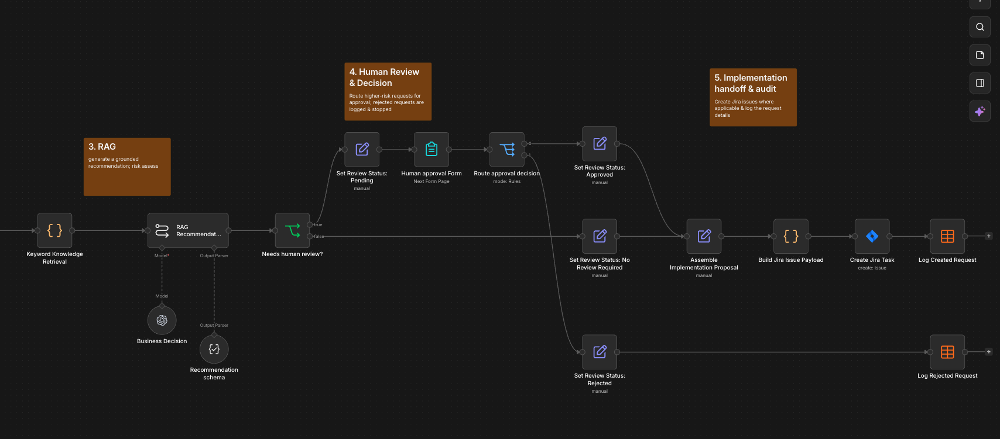

# AI Process & Knowledge Assistant

I built this project to get more hands-on experience with AI-supported process automation and to move beyond only coordinating technical work into implementing workflow logic, LLM-based decisions, integrations, and human-in-the-loop automation myself.

The project is an n8n workflow that takes an internal automation request from intake to evaluation, approval, Jira handoff, and audit logging.

## Workflow Overview

## What it does

- collects automation requests through an n8n form
- normalizes the submitted data
- retrieves relevant internal guidance from a mock knowledge base
- generates a grounded recommendation and risk assessment with an LLM
- decides whether human review is required
- routes higher-risk requests through approval or rejection
- creates Jira implementation tasks for approved or low-risk requests
- logs final outcomes for traceability

## Architecture

Request Form  
→ Normalize Input  
→ Knowledge Retrieval  
→ RAG Recommendation  
→ Human Review Decision

- Approved → Jira → Audit Log
- Rejected → Audit Log
- No Review Required → Jira → Audit Log

## Key Design Decisions

- Used structured JSON output so downstream routing does not depend on free-form LLM responses.
- Kept human review for higher-risk or customer-facing decisions instead of treating the LLM as the final authority.
- Moved Jira labels from hard-coded values to an approved label policy.
- Reused the same implementation path for approved and no-review-required requests instead of duplicating workflow logic.
- Added an audit log so rejected requests remain traceable and successful requests can be linked to Jira issues.

## What I learned

Building this helped me get more comfortable with:

- working with typed JSON data across n8n nodes
- designing reliable LLM outputs with schemas
- separating deterministic workflow logic from AI-based interpretation
- grounding recommendations with retrieved context
- handling branch convergence without referencing unexecuted nodes
- integrating with Jira using the fields and data types the target system actually expects

One useful lesson was that RAG does not automatically eliminate hallucinations. The quality of the recommendation still depends on the retrieved context and how tightly the prompt constrains unsupported details.

## Current RAG Setup

The current version uses keyword/tag-based retrieval over a small synthetic knowledge base.

I kept this first version simple so I could understand the full retrieval → grounding → decision flow before moving to embeddings and vector search.

## Tech

- n8n
- OpenAI API
- JavaScript
- structured JSON output
- RAG-style retrieval
- human-in-the-loop approval
- Jira
- n8n Data Tables

## Limitations

This is a learning and portfolio project, not a production system.

- the knowledge base is synthetic
- retrieval is keyword-based rather than vector-based
- the workflow evaluates and hands off automation opportunities; it does not implement the submitted automation itself

## Next Steps

- replace keyword retrieval with vector-based semantic search
- connect a real document source
- add retrieval evaluation and source-quality checks
